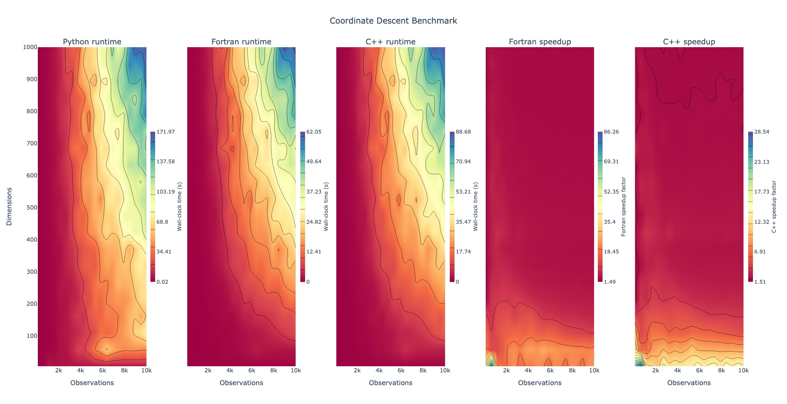
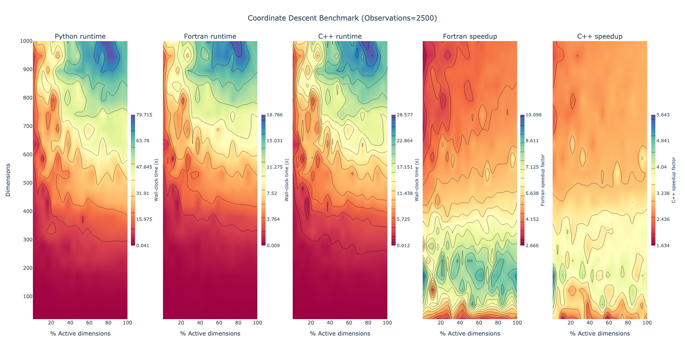

Files for benchmarking coordinate descent algorithm using `Python`, `Fortran`, and `C++` languages with Python interface for use in [equadratures](https://github.com/Effective-Quadratures/equadratures).

Refer to [this discourse post](https://discourse.equadratures.org/t/the-quest-for-speed-an-indicative-survey-in-improving-performance/144/2) for full description regarding the code and context.

### System Configuration

The codes were tested with the following hardware/software:

- MacBook Pro 15-inch 2017
    - Intel i7-7920HQ @ 3.1GHz
    - 16GB 2133MHz
- macOS 10.15.7
- OpenBLAS 0.3.13
- Python 3.8.6
- Numpy 1.20.1
- pybind11 2.6.2
- Eigen 3.3.9

### Benchmarking

Interactive plots of the benchmark can be found by selecting the following images:

*Figure 1: Contours of dimensions against Observations for Python, Fortran, and C++; and speedups relative to Python*

*Figure 2: Contours of dimensions against % of active dimensions with fixed 2500 observations for Python, Fortran, and C++; and speedups relative to Python*

### File descriptions

- 0-benchmark-python-fortran.py
  - 1st plot benchmark, but using matplotlib instead.
 
- 1-benchmark-python-fortran-ndims-vs-nactive.py
  - 2nd plot benchmark, by fixing observations to 2500, and varying number of active dimensions.
 
- solver_fortran.f90
  - Fortran version of the code, but contains two different subroutines, elastic_net_cd_for and elastic_net_cd_purefor
  - The first subroutine uses explicit calls to BLAS. It is multi-threaded.
  - The second is written simply using Fortran built-in calls. It is not multi-threaded.
  - Compiled by running: sh compile.sh
 
- solver_cpp.cpp
  - C++ version of the code, but contains two different functions, elastic_net_cd_cpp and elastic_net_cd_cpp_nosets
  - The latter avoids the use of sets when checking for active dimensions.
  - Requires the Eigen library added to environment path. In this case, a version of it is included in the root directory, so no changes are required in the Path.
  - Compiled by running: python cppsetup.py build_ext -i; with the -i flag compiling the module in-place rather than globally - optional.
 
- solver_python.py
  - Python version of the code - same as the current version on the develop branch.
  - Written by @ascillitoe.
 
- compile.sh
  - Bash script to compile Fortran code.
 
- cppsetup.py
  - Setup file to compile C++ code
 
